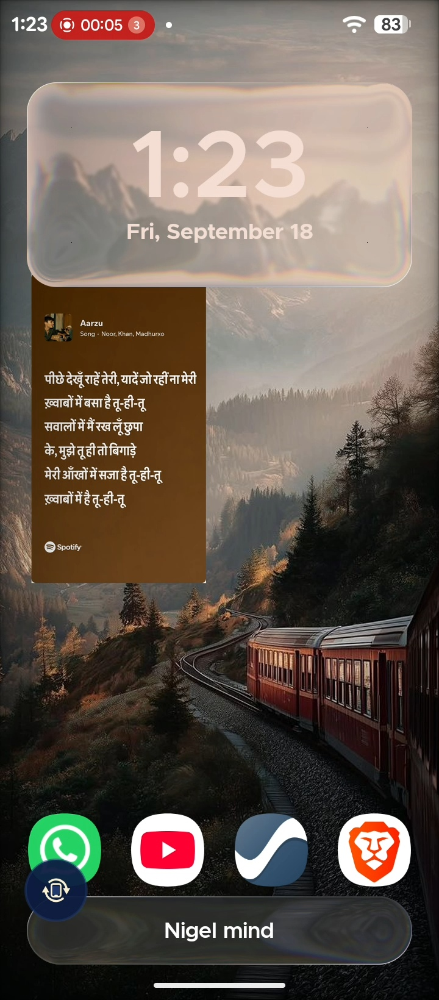
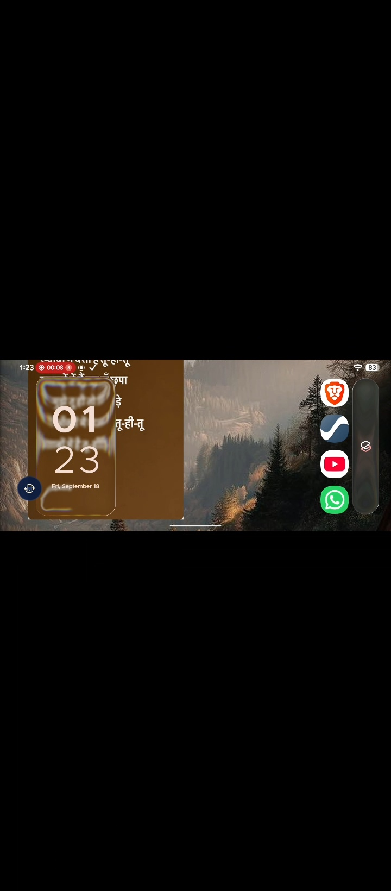
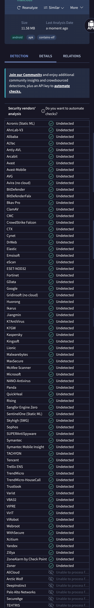

# Side Rotate

Side Rotate is an Android utility application designed to provide reliable, on-demand screen rotation without requiring system auto-rotate to remain enabled.

When auto-rotate is locked and the device is physically tilted sideways, Side Rotate renders an unobtrusive floating rotation button at the bottom corner of the display. Tapping this button instantly rotates the screen orientation while keeping auto-rotate locked.

---

## Demonstration

| Portrait Mode | App Dashboard | Landscape Mode |
| :---: | :---: | :---: |
|  |  |  |

A full demonstration showcasing smart tilt detection, the corner floating rotation button, swipe-to-dismiss gesture, and instantaneous screen rotation is available:

- [Watch Live Video Demonstration on YouTube Shorts](https://youtube.com/shorts/g9uGrL3bMnk)

---

## The Problem Solved

On stock Android, a small rotation suggestion button appears in the navigation bar when the phone is tilted. However, across various Android devices and custom operating systems, this functionality is often broken, unreliable, or completely missing:

- **Gesture Navigation Conflicts:** When full-screen gesture navigation is enabled, the traditional navigation bar is hidden, preventing the native system rotation suggestion button from ever appearing.
- **Aggressive Background Killing:** Many custom manufacturer skins aggressively restrict background orientation sensors when an app is not actively focused, breaking native tilt detection.
- **Inconsistent Accessibility:** Users frequently want a persistent, thumb-friendly floating rotation control that behaves predictably and stays consistent across all apps, media players, and home screens.

Side Rotate solves this seamlessly by maintaining an ultra-lightweight foreground orientation monitor that renders an accessible overlay button on demand, regardless of your navigation mode or launcher.

---

## Key Features

- **Rotation Lock Preserved:** Rotates the display system-wide by writing directly to system user rotation settings, keeping auto-rotate turned off.
- **Dual Rotation Engines:**
  - *Direct System Rotation (Primary):* Immediately updates the system orientation setting.
  - *Auto-Rotate Quick Pulse (Fallback):* Momentarily engages sensor orientation for devices with restricted settings access.
- **Swipe-to-Dismiss Gesture:** If the rotation button appears and rotation is not desired, a quick swipe in any direction flings it off-screen immediately until the next tilt.
- **Zero Battery Consumption on Sleep:** Automatically suspends accelerometer listeners whenever the display is turned off or locked, consuming zero extra battery in pockets or while idle.
- **High-Contrast Aesthetics:** Features a refined midnight-navy and warm-cream palette with rounded corner geometry, smooth entrance/exit animations, and tactile haptic feedback.
- **Android 13+ Themed Adaptive Icons:** Includes a two-layer adaptive launcher icon with a dedicated monochrome layer that dynamically matches system wallpaper palettes on Android 13, 14, and 15.
- **Built-in GitHub Auto-Updater:** Checks for new releases directly from GitHub, downloads APK updates with real-time progress, and prompts the native Android package installer.
- **Customizable Interface:**
  - Corner position selection (Bottom-Left or Bottom-Right).
  - Real-time button size adjustment (48dp to 72dp) with dynamic on-screen scaling.
  - Auto-dismiss timeout configuration (2s to 8s) with state-transition timers.
  - Haptic feedback toggle.
  - Optional 180-degree upside-down rotation support.

---

## Security and Privacy

Side Rotate is engineered with complete respect for user privacy:

- **Zero Analytics or Trackers:** No tracking libraries, telemetry, crash reporters, or third-party analytics are embedded.
- **No Personal Data Collected:** The application does not collect, log, transmit, or process any personal or device identifiers.
- **Network Scope:** Internet permission is used solely to query the public GitHub API for app updates and download release binaries directly from this repository.
- **Verified Antivirus Scan:** Clean security rating on VirusTotal with zero detections across all scanning vendors.

<div align="center">
  
</div>

---

## Required Permissions

To function across all apps and control display rotation, Side Rotate requires the following permissions:

| Permission | Purpose |
| :--- | :--- |
| **Display Over Other Apps (`SYSTEM_ALERT_WINDOW`)** | Allows rendering the floating rotation button above third-party applications. |
| **Modify System Settings (`WRITE_SETTINGS`)** | Allows updating the system orientation value without toggling auto-rotate on. |
| **Ignore Battery Optimizations** | Prevents aggressive operating system background cleaners from killing the orientation listener. |
| **Post Notifications (`POST_NOTIFICATIONS`)** | Required on Android 13+ for persistent foreground service execution. |
| **Internet (`INTERNET`)** | Used exclusively for querying GitHub releases and downloading app updates. |
| **Request Install Packages (`REQUEST_INSTALL_PACKAGES`)** | Allows in-app installation of downloaded APK updates. |

---

## Installation

### Method 1: Download from GitHub Releases
1. Navigate to the [Releases](https://github.com/code4nigel/SideRotate/releases) tab.
2. Download the latest `SideRotate_vX.X.X.apk`.
3. Open the APK on your Android device and confirm installation.

### Method 2: Install via ADB
```bash
adb install -r version/SideRotate_v1.0.4.apk
```

---

## Development and Release Automation

### Building from Source
Ensure Android SDK and Java 17+ are installed, then run:

```bash
./gradlew assembleDebug
```

### Automated Versioning and Release
A Python release script is included to automate version bumps, compiling, and artifact management:

```bash
python release.py
```

To specify an explicit version number and release message:
```bash
python release.py 1.0.4 "Release notes or commit message"
```

The script will:
1. Increment the `versionCode` and update `versionName` in `app/build.gradle.kts`.
2. Compile the debug APK via Gradle.
3. Archive the generated binary into the `version/` directory with the format `SideRotate_v<version>.apk`.
4. Commit changes and create a Git release tag.
5. Push to GitHub to trigger automated release workflows.

---

## License

Copyright (c) 2026 **Shivanshu Yadav**. All Rights Reserved.

See the [LICENSE](LICENSE) file for terms and conditions.

---

Built with ❤️ by [nigelweb](https://github.com/code4nigel)
